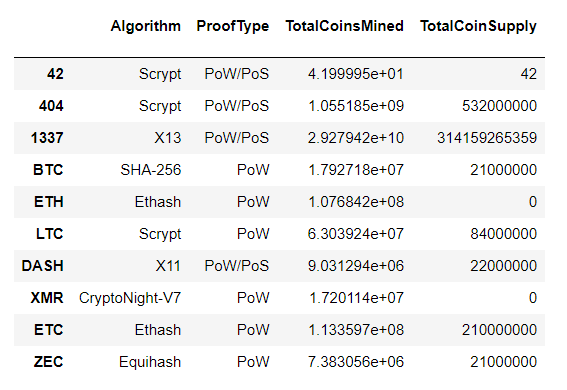
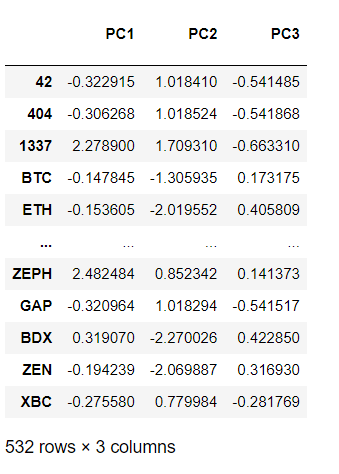
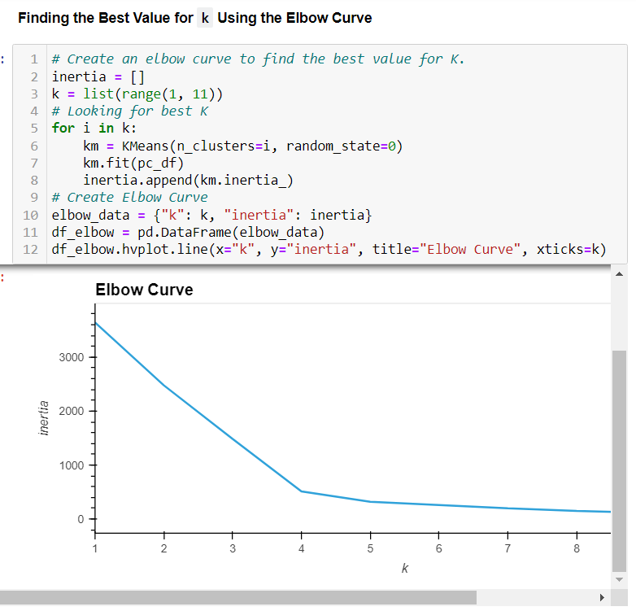
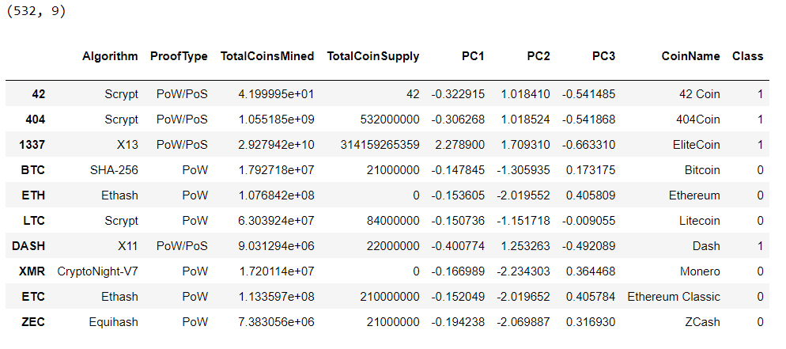
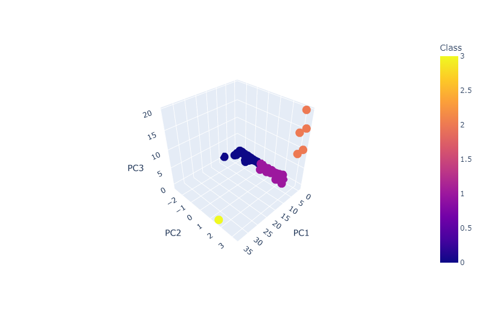

# Cryptocurrencies

This challenge was a cryptocurrency analysis using Unsupervised Machine Learning and Pandas in Python

## Purpose

A client, Accountability Accounting is a prominent investment bank that is interested in offering a new cryptocurrency investment portfolio for its customers. The purpose of this project was to create a report that includes what cryptocurrencies are on the trading market and how they could be grouped to create a classification system for their new investment. The original data was from CryptoCompare, and is preprocessed using Pandas to fir Unsupervised Machine Learning Models. The data is grouped using a clustering algorithm and hvPlot was used to create visualizations in order to show the results.

## Results

The first step was to preprocess and transform the data for Principal Componenet Analysis (PCA). This included keeping all the cryptocurrencies that are being traded and coins are mined as well as dropping all the rows with null values. The two text features were also numerically encoded using the get_dummies() method. Lastly, the data was scaled using the StandardScaler() method.

Next, the Principal Component Analysis was done to reduce the dimensions to three principal components.

After this, I created an elbow curve using hvPlot to find the best value for K; meaning how many clusters I could divide the cryptos in. I ran the K-means algorithm to predict the K clusters for the cryptocurrencies' data.

If you analyze the elbow curve plot, you can see that the optimal number of clusters is 4, because that is where the line begins to change horizontally. Once this was determined, a K-Means model analysis was done to fit the PCA dataframe and predict the clustering. 

Next, using Plotly Express and hvPlot, I created a scatter plot to help visualize the distinct groups that correspond to the three principal components. When you look at the plot, you can see that there are three major groups and one outlier.

3D-Scatter with Clusters

Then, I created a table with all of the currently tradable cryptocurrencies using the hvplot.table() function.

The last plot created was an hvplot scatter plot. This plot was to cluster the cryptocurrencies by the Total Coin Supply and the Total Coins Mined. When analyzing this graph, you can see that it shows two major outliers. The first one show a lot of coin supply, but not many coins mined, (TurtleCoin). The second one shows both a lot of coin supply and a lot of coins mined, (BitTorrent).

.png)

## Summary

In conclusion, it can be said that this analysis was successful in that we were able to group all of the cryptocurrencies into four groups, or clusters. The goal of Unsupervised Machine Learning is to finds patterns within the data where there is no known output. In order to create a crypto investment portfolio, we would need to look further into these four clusters.